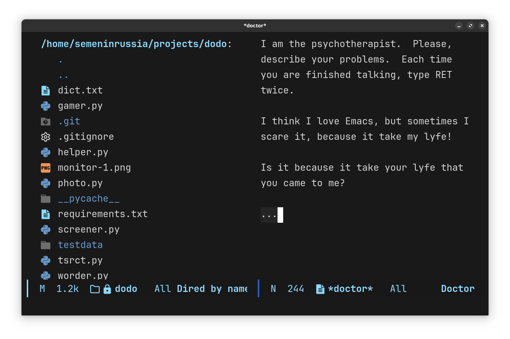
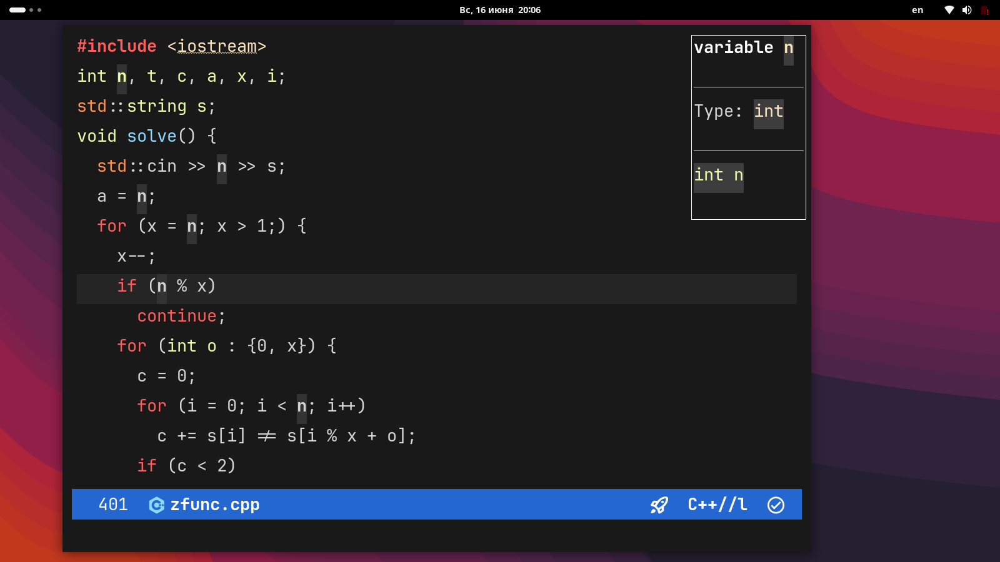
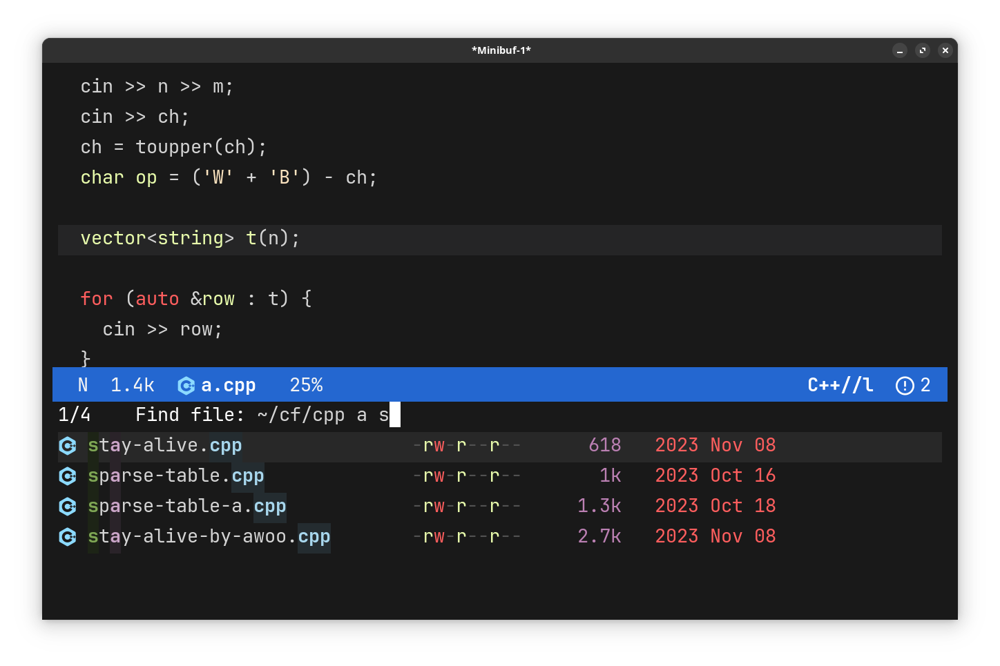

* semenInRussia Emacs config (maybe called SEMACS?)

A good (I think) configuration for [[https://emacs.org][Emacs]] which have a *BIG AMOUNT* of unique features.  This config 100% not for everyone Emacs user.  I think you must have any Emacs background to use it (but maybe not)

This config is *required in Emacs29.1 version*, even better if Emacs was compiled with native-compilation feature

In this config you can find a big amount of new concepts for editor configs (I think).  One of the most interesting features is that you can install this config (not count installing fonts, [[https://github.com/AbiWord/enchant][enchant2]] (spell checker) and [[https://github.com/BurntSushi/ripgrep][ripgrep]]) very quickly, because all packages are built in zip archive (see releases or [[#Installation]] section)

Some men asked me "So, you copied Doom. Why?".  My answer is that my config is even better than Doom (for me) + it isn't a copy of Doom, I even wasn't user of Doom never.

My configuration have a big amount of interesting concepts which are unique properties.  Plus the biggest part of my config is opposite to Doom.  Things where my config is better on 100% I will tell #nodoom, where is better by my opinion (everywhere, but here diff is bit) I will tell #dddm

** Features

- a beautiful design.

  It includes
  + a big amount of themes
  + a big support of two themes: light and dark.  You can change it for session using =M-x my-light-theme= or =M-x my-dark-theme=.  If you need to change it forever, replace a line in =my-load-theme.el= file
  + diagnostics and other things from echo area at the top left corner (#nodoom)
  + amazing modeline
  + icons everywhere (#nodoom)
  + No to ~prettify-mode~
  + Small, but amazing padding around screen (#nodoom)

- Very (really very) fast start up. (#nodoom #nodoom)

  On my old computer ~doomemacs~ starts in 4+ seconds (it prints it after startup), but in fact it also wait for when themes, modeline and other things will be loaded.  My config on other side take only 2secs(sometimes even 0.9s) and almost don't take time after.

- A big amount of packages (192+)

- Reload the configuration Emacs lisp file after it saved.  Inspired by ~VSCode~ and ~NVChad~

- more fast way to install

- ~meow~ over ~evil~ (#dddm)

- Own package manager, built over ~straight.el~. (#nodoom)

  The benefit is a speed, it only one time add to the a path ~load-path~.  And other times Emacs will find a package only in this directory, instead of 220+ other directories when use ~straight.el~

  It's even better than Doom package manager, my package manager also join all autoloads file into one and byte compile it like Doom

- Use good-practice solutions, like replace heavy things with the more light. (#nodoom)

- Use ~perspectives~ (virtual desktops/workspaces for Emacs) with intuitive way

- Some optimizations for Windows

- big usage of [[https://github.com/oantolin/embark/][embark]] (just fun)

- Some things for sport programming

  + special recipes to compile and run C++ files
  + Edit input.txt (add input samples), now you can press f5 in C++ buffer, choose run with input.txt. wkw!
  + in gdb debugger you can just insert whole input.txt content in one line (it's useful)
  + a big amount if helpful snippets
  + insert template with snippet ! and multitester with !!

** Extension (my config as framework)

Interesting way to extension, which you can call chaos.

if you need use this "framework":
You don't need my ~pam~ package manager!  You don't need any strict file system!  You don't need macros!

Every config file can be in any sub-folder of ~/lisp/~, have any name, contains any things.  Only one separation is that files which not always needed at startup you can place at ~/lisp/local-projects/~.

You will build config ~emacs --modules~ and all files from ~/lisp/~ will be joined at ~/dist/my-modules.el~ you can see source of my-modules build inside ~local-projects/my-build-config.el~ (in this file you can also change order of including lisp files into my-modules) also you can generate autoloads files for local-projects (use ~--local-projects~ flag) after that you everywhere can use [[https://www.gnu.org/software/emacs/manual/html_node/elisp/Autoload.html][autoloaded]] functions from ~local-projects~.

Also you can build config with call ~emacs --modules~ in any shell

So main files (files of framework part) are only:

- ~early-init.el~ some speed-hacks beginnings for ~init.el~
- ~init.el~ but only a part, where handling of CLI arguments
- ~local-projects/my-build-config.el~, I think you understand it

** Packager Manager

this config uses a small package manager which is wrapper over straight.el.  I called it `pam`

Idea is simple:

- when install :: after package is cloned and built in straight directory, `pam` copy all important package files into directory `pam` and append autoloads into one certain `pam` file

- when use :: just add =pam= directory to =load-path= and load ONCE AT EMACS START. it's better than load every autoload and add to load path ever new package after startup. on windows this optimization is matter

so there are two types of handling =(pam-use-package 'package)=:
1. install with `straight`
2. do nothing

if your packages are installed choose second which is default.  If you need to install new packages choose 1, you can either use =emacs --install= or =M-x pam-install-everything-mode=

** Installation

Before installation you must install ~JetBrainsMono Nerd Font~ (use [[https://github.com/ryanoasis/nerd-fonts/releases/download/v3.2.1/JetBrainsMono.zip][this]] zip file) or other Nerd Font, if your font isn't JetBrainsMono, change the variable inside =.config/emacs/lisp/ui/my-fonts.el=

Also suggest to install [[https://github.com/BurntSushi/ripgrep][ripgrep]] tool.

Also (if you are Mac OS or Linux user) suggest install [[https://github.com/AbiWord/enchant][enchant]]: a spell checker, see [[https://github.com/minad/jinx][jinx]]

To install my config on your config as main use the following shell command, if you need to only try this config (without delete your thing), change .config/emacs on anything like ~/semacs (on windows replace .config with anything like AppData/Roaming)

#+begin_src shell
  # cd home directory!
  wget https://github.com/semenInRussia/emacs.el/releases/download/latest/semacs.zip && mkdir .config/emacs -p && unzip -o -d .config/emacs semacs.zip

  # on windows
  # cd home directory %USER%
  cd AppData/Roaming/
  wget https://github.com/semenInRussia/emacs.el/releases/download/latest/semacs.zip && unzip -o -d .emacs.d semacs.zip
#+end_src

In this commands 3 steps:
1. Install the archive which is updated automatically after every commit.  This archive contains a configuration with installed 3rd party packages
2. Make a directory where config will be located (defaults to .config/emacs but in windows it can be anything else)
3. Unzip the archive to this folder

after this command on Linux or MacOS you *MUST* run ~nerd-fonts-install-fonts~, maybe not

Also if you need in [[https://github.com/minad/jinx][jinx]], run ~M-x pam-use-package jinx~

You can extract an archive into any directory, and run emacs using ~--init-directory~ flag, like:

#+BEGIN_SRC shell
  emacs --init-directory=~/semacs    # semacs is cloned repo source
  # or
  emacs -l init.el     # init.el is the file from repo
#+END_SRC

So you can test it without ~chemacs~ and other stupid things, you even not need in emacs29 --init-directory, but you still needed in emacs29

** Requirements

- *Emacs 29.1+* (check [[https://www.gnu.org/software/emacs/][here]])
- Ripgrep (check [[https://github.com/BurntSushi/ripgrep][here]])
- Enchant :not for Windows: (check [[https://github.com/AbiWord/enchant][here]], also install needed dictionaries, maybe use the following shell)

  #+begin_src shell
    cd .config/enchant/
    wget https://raw.githubusercontent.com/LibreOffice/dictionaries/master/en/en_US.dic
    wget https://raw.githubusercontent.com/LibreOffice/dictionaries/master/en/en_US.aff
    wget https://raw.githubusercontent.com/LibreOffice/dictionaries/master/ru_RU/ru_RU.dic
    wget https://raw.githubusercontent.com/LibreOffice/dictionaries/master/ru_RU/ru_RU.aff
    mkdir hunspell
    mv en_US.aff en.aff
    mv en_US.dic en.dic
    mv *dic hunspell
    mv *aff hunspell
  #+end_src

- Fonts (better [[https://www.jetbrains.com/lp/mono/][JetBrains Mono]] and Symbols Nerd Font Mono : [[https://github.com/ryanoasis/nerd-fonts/releases/download/v3.2.1/NerdFontsSymbolsOnly.zip][link to zip archive]])
